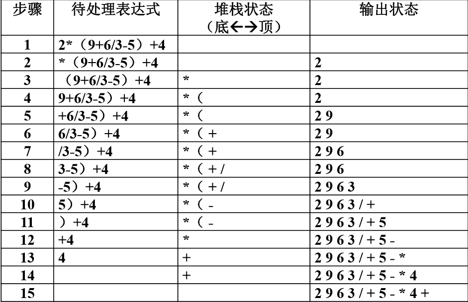
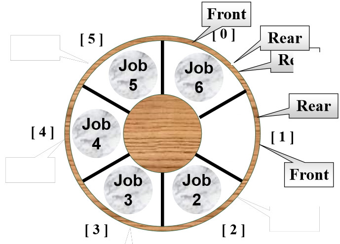
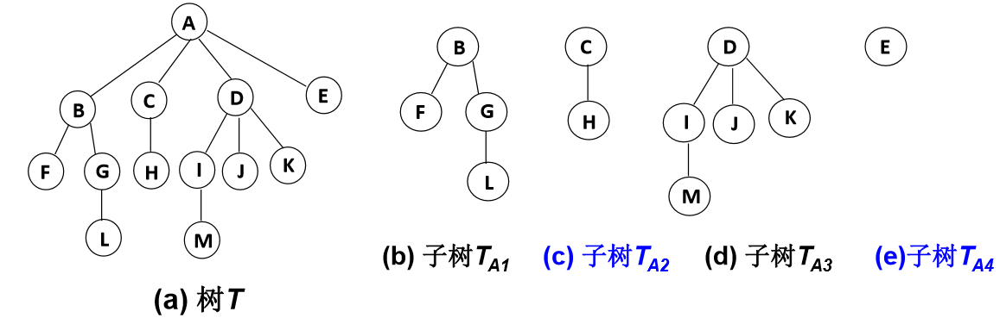
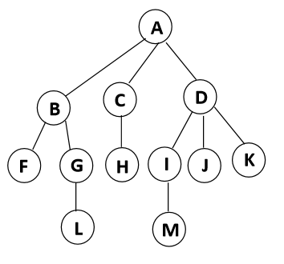
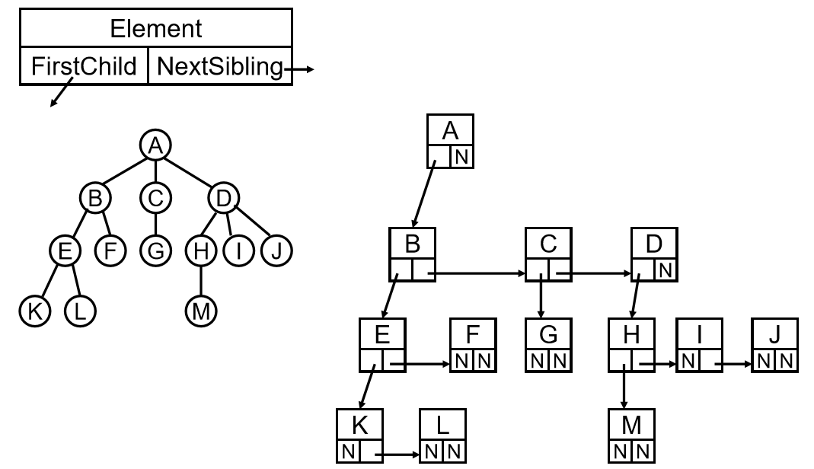

# 数据结构和算法

## 什么是数据结构

数据结构是数据对象，以及存在于该对象的实例和 组成实例的数据元素之间的各种联系。

数据结构是ADT（抽象数据类型Abstract Data Type）的物理实现。

数据结构（data structure）是计算机中存储、组织 数据的方式。通常情况下，精心选择的数据结构可以 带来最优效率的算法。

* 解决问题方法的效率，跟数据的组织方式有关
* ###### 解决问题方法的效率，跟空间的利用效率有关有关
* 解决问题方法的效率，跟算法的巧妙程度有关

* 数据对象在计算机中的组织方式
  * 逻辑结构
  * 物理存储结构

* 抽象数据类型（Abstract Data Type）

  * 数据类型

  * 数据对象集 
  * 数据集合相关联的操作集

​        抽象：描述数据类型的方法不依赖于具体实现 ：与存放数据的机器无关 ，与数据存储的物理结构无关 ，与实现操作的算法和编程语言均无关
**只描述数据对象集和相关操作集“是什么”，并不涉及 “如何做到”的问题**


## 什么是算法

* 算法

1. 一个有限的指令集

2. 接收一些输入(有限情况下不用输入)

3. 产生输出
4. 一定在有限步骤之后终止
5. 每一条指令必须 ：有充分明确的目标，不可以有歧义 ；计算机能处理的范围之内 ；描述应不依赖于任何一种计算机语言以及具体的实现 手段

### 什么是好的算法

* 空间复杂度S(n)——根据算法写成的程序在执行时 占用存储单元的长度。这个长度往往与输入数据的 规模有关。空间复杂度过高的算法可能导致使用的 内存超限，造成程序非正常中断。

* 时间复杂度T(n)——根据算法写成的程序在执行时 耗费时间的长度。这个长度往往也与输入数据的规 模有关。时间复杂度过高的低效算法可能导致我们 在有生之年都等不到运行结果。

* 复杂度的线性表示法

T(n) = O(f(n))表示存在常数C >0, n0>0 使得当 n>=n0时有T(n)  <= C·f(n) 

T(n) = Ω(g(n))表示存在常数C >0, n0>0 使得当 n >= n0时有T(n) >= C·g(n) 

T(n) = Θ(h(n))表示同时有T(n) = O(h(n))和 T(n) = Ω(h(n))

### 应用实例

* 求最大子列和

```cpp
// 给定N个整数的序列{ A1, A2, …, AN}， 求函数的最大值
/**************************
 *	参数一： 子列数组       *
 *  参数二： 子列元素个数    *
**************************/
int MaxSubseqSum1(int A[], int N)
{
	int ThisSum, MaxSum;
	int i, j, k;
	// i是子列左端位置
	for (int i = 0; i < N; i++)
	{
		// j是子列右端位置
		for (int j = i; j < N; j++) {
			ThisSum = 0;    // 表示从A[i] 到A[j]的子列和
			for (int k = i; k <= j; k++)
				ThisSum += A[k];
			if (ThisSum > MaxSum)    // 如果得到这个子列和更大
				MaxSum = ThisSum;    // 就更新结果
		}
	}
	return MaxSum;
}

// 方法二
int MaxSubseqSum(int A[], int N)
{
	int ThisSum, MaxSum;
	int i, j, k;
	// i是子列左端位置
	for (int i = 0; i < N; i++)
	{
		ThisSum = 0;    // 表示从A[i] 到A[j]的子列和
		// j是子列右端位置
		for (int j = i; j < N; j++) {
			
			ThisSum += A[j];   // 对于相同的i 不同的j 在j-1次循环上加一项即可
			if (ThisSum > MaxSum)    // 如果得到这个子列和更大
				MaxSum = ThisSum;    // 就更新结果
		}
	}
	return MaxSum;
}
```

# 线性结构

## 什么是线性表

* 线性表（Linear List）是同类型元素构成有序序列的线性结构

1. 表中的元素个数称为线性表的长度
2. 线性表没有元素时称为空表
3. 表的起始位置称为表头，表的结束位置称表尾

## 线性表的顺序存储实现

* 线性存储

```cpp
// 定义一个线性表
typedef struct LNode *List;
typedef int Position;
typedef int ElementType;

// 通过数组的连续存储空间顺序存放线性表的各元素
struct LNode {
	ElementType Data[MAXSIZE];
	int Last;
};

struct LNode L;

// 线性表的初始化
List MakeEmpty()
{
	List Ptrl;
	Ptrl = (List)malloc(sizeof(struct LNode));
	Ptrl->Last = -1;
	return Ptrl;
 }

// 查找
#define ERROR -1

Position find(int i, ElementType X)
{
	Position i = 0;
	while (i < L.Last && L.Data[i] != X)
	{
		i++;
	}
	if (i > L.Last) return ERROR;
	else  return i;    //在表外返回错误
	
}

// 插入
bool Insert(List L, ElementType X, Position P)
{
	// 检查空间是否已满
	if (P = MAXSIZE - 1)
	{
		printf("空间已满\n");
		return false;
	}

	// 检查位置是否合法
	if (P > L->Last || P < 0)
	{
		printf("位置不合法\n");
		return false;
	}
	for (int i = L->Last; i >= P; i--)
	{
		// 将位置p及以后的元素顺序向后移动
		L->Data[i + 1] = L->Data[i];
	}
		L->Data[P] = X;   // 新的元素插入
		L->Last++;
		return true;
}

// 删除
bool Delete(List L, ElementType X, Position P)
{
	// 检查位置是否合法
	// 检查位置是否合法
	if (P > L->Last || P < 0)
	{
		printf("没有该元素\n");
		return false;
	}
	// 位置P的后一个元素向前移动
	for (int i = P+1; i <= L->Last; i++)
	{
		L->Data[i-1] = L->Data[i];
	}
	// 总长度 - 1；
	L->Last--;
	return true;
}

```

* 链式存储

```cpp
/*******************
*				   *
*  链式存储实现      *
*				   *
********************/


// 不需要逻辑上相邻的连个元素物理上也相邻
// 通过链来建立起数据元素之间的逻辑关系

// 定义一个线性表
//typedef struct LNode* ptrToLNode;
typedef int ElementType;

// 通过数组的连续存储空间顺序存放线性表的各元素
struct LNode {
	ElementType Data;   // 节点代表的数据
	LNode* Next;        // 指向下一个节点的位置
};

typedef LNode* Position;
typedef LNode* List;

#define ERROR NULL

// 求表长
int Length(List Ptr)
{
	int j = 0;
	while (Ptr)
	{
		Ptr = Ptr->Next;
		j++;
	}
	return j;
}

// 查找
Position Find(List L, ElementType X)
{
	Position p = L;    // P指向L的第一个节点
	while (p && p->Data != X)
		p = p->Next;
	if (p)
		return p;
	else
		return ERROR;
}

// 插入
bool Insert(List L, ElementType X, Position p)
{
	Position tem, pre;
	// 查找p的前一个节点
	for (pre = L; pre && pre->Next != p; pre = pre->Next);
	
	// 位置检查
	if (pre = NULL)
	{
		printf("插入的位置有误\n");
		return false;
	}
	else
	{
		tem = (Position)malloc(sizeof(struct LNode));
		tem->Data = X;
		tem->Next = p;
		pre->Next = tem;
		return true;
	}
}

// 带头节点的删除
bool Delete(List L, Position p)
{
	Position tmp, pre;
	for (pre = NULL; pre && pre->Next != p; pre = pre->Next);
	
	if (pre == NULL || p == NULL)   // p所指的节点不在L中
	{
		printf("删除的的位置有误\n");
		return false;
	}
	else
	{
		// 找到了p的前一个节点
		// 将p的节点删除
		pre->Next = p->Next;
		free(p);
		return true;
	}
}
```


### 广义表

* 广义表是链式表的推广
* 对于线性表而言，n个元素都是基本的单元素
* 广义表中，这些元素不仅可以是单元素也可以是另一个广义表

### 多重链表

* 多重链表：链表中的节点可以隶属于多个连

多重链表中的节点的指针域会有多个，但是包含两个指针域的链表不一定是多重链表，例如双线链表

* 用途

如树、图这种相对复杂的数据结构都可以使用多重链表的方式实现存储

## 堆栈

* 前缀、中缀和后缀表达式
* 表达式求值的基本方法

从左到右读入表达式的各项，运算数：入栈。运算符：从栈中弹出适当数量的运算数，计算并结果入栈，最后，堆栈顶上的元素就是表达式的结果值。

* **基本策略**：将中缀表达式转化为后缀表达式

```c
//例1：
 2+9/3-5 ————>   2 9 3 5 / + -
// 运算数的相对顺序不变
// 运算符号顺序发生改变
     需要存储等待中运算符号
     要与当前的运算符与等待中的预算符号比较
     
//例2：
  a * (b + c) / d ———— a b c + * d /
```

* 中例转换示例：`（ 2*（9+6/3-5）+4）`



### 栈的顺序存储实现

* 栈的顺序存储结构通常是由一个**一维数组**和一个记录**栈顶元素位置**的变量组成

```c
typedef int Position;
typedef int ElementType;

struct SNode {
	ElementType *Data; // 存储元素的数组
	Position Top;      // 栈顶指针
	int MaxSize;       // 栈顶的最大容量
};

typedef SNode* Stack;
#define ERROR -1

// 创建一个栈
Stack Create(int MaxSize)
{
	Stack s = (Stack)malloc(sizeof(struct SNode));
	s->Data = (ElementType*)malloc(sizeof(ElementType));
	s->Top = -1;
	s->MaxSize = MaxSize;
	return s;
}

// 判断站是否满
bool Isfull(Stack S)
{
	return S->Top = S->MaxSize - 1;
}

// 入栈
bool Push(Stack S, ElementType X)
{
	if (Isfull(S))
	{
		std::cout << "栈已满，操作失败\n" << std::endl;
		return false;
	}
	else
	{
		// 栈顶加 1
		return S->Data[++(S->Top)] = X;
	}
}

// 站是否为空
bool IsEmpty(Stack S)
{
	// 注意双等号
	return (S->Top == -1);
}

ElementType PopStack(Stack S)
{
	if (IsEmpty(S))
	{
		std::cout << "栈已空，操作失败\n" << std::endl;
	}
	else
	{
		return (S->Data[(S->Top)--]);
	}
}
```


### 栈的链式存储实现

* 栈的链式存储结构实际上就是一个单链表，叫做链栈。插入和删除操作只能在链栈的栈顶进行

```c
typedef int ElementType;
typedef struct SNode* ptrToStack;

struct SNode {
	ElementType Data;  // 存储栈中元素
	ptrToStack Next;   // 栈顶指针
};

typedef ptrToStack Stack;
#define ERROR -1

// 创建一个栈
Stack Create( )
{
	Stack s = (Stack)malloc(sizeof(struct SNode));
	s->Next = NULL;
	return s;
}

// 站是否为空
bool IsEmpty(Stack S)
{
	// 注意双等号
	return (S->Next == NULL);

}

// 入栈
bool Push(Stack S, ElementType X)
{
	// 将元素压入堆栈 S
	ptrToStack temCell = NULL;
	temCell = (ptrToStack)malloc(sizeof(struct SNode));
	temCell->Data = X;
	temCell->Next = S->Next;

	S->Next = temCell;
	return true;
}

// 弹出数据
ElementType PopStack(Stack S)
{
	ptrToStack firstCell;
	ElementType topElem;

	if (IsEmpty(S))
	{
		printf("堆栈空\n");
		return ERROR;
	}
	else
	{
		firstCell = S->Next;
		topElem = firstCell->Data;
		S->Next = firstCell->Next;
		free(firstCell);
		return topElem;
	}

}
```

### 堆栈的其他应用

* 函数调用及递归实现
* 深度优先搜索
* 回溯算法


## 队列

**队列：**具有一定操作约束的线性表，插入和删除操作只能在一端插入，而在另一端删除

* 数据插入：入队
* 数据删除：出队

### 顺环队列

一个n节点的队列有n+1中情况；1 。。。。N和空，在判断顺换队列空和满的的情况都是front = rear,造成空和慢的情况无法区分

**解决方法：**

* 使用额外的标记，size或者Tag域

插入元素的时候size加1，在删除元素的时候size - 1，最后判断size的值。

tag域在插入的时候tag设为1，删除的时候tag设为0，判断Tag的状态来判断最后一次的操作是插入还是删除。

### 队列的线性实现

* 队列的顺序存储结构通常由一个一维数组和一个记录队列头元 素位置的变量front以及一个记录队列尾元素位置的变量rear组成

```c
// 构成元素
// 一个一维数组，记录队列头节点位置的变量front，记录尾元素位置的变量rear
#define ERROR -1

typedef int Position;
typedef int ElementType;


struct QNode {
	ElementType *Data;   // 存储元素的数组
	Position Front, Rear;  // 栈头和栈尾指针
	int MaxSize;   // 队列的最大容量
};

typedef struct QNode* Queue;

// 创建一个队列
Queue CreateQueue(int MaxSize)
{
	Queue Q = (Queue)malloc(sizeof(struct QNode*));
	Q->Data = (ElementType*)malloc(MaxSize * sizeof(ElementType));
	Q->Front = Q->Rear = 0;
	Q->MaxSize = MaxSize;
	return Q;
}

// 是否满
bool Isfull(Queue Q)
{
	return ((Q->Rear + 1) % Q->MaxSize == Q->Front);
}

// 向队列中增加数据
bool AddQ(Queue Q,ElementType x)
{
	if (Isfull(Q))
	{
		printf("队列已满\n");
		return false;
	}
	else
	{
        // Front和rear 指针的移动 采用“加1取 余”法，体 现了顺序存储的“循环 使用”。 
		Q->Rear = ((Q->Rear + 1) % Q->MaxSize);
		Q->Data[Q->Rear] = x;
		return true;
	}
}

// 队列是否为空
bool IsEmpty(Queue Q)
{
	return (Q->Front == Q->Rear);
}

// 删除队列中的元素
ElementType DeleteQ(Queue Q)
{
	if (IsEmpty(Q))
	{
		printf("队列已空\n");
		return ERROR;
	}
	else
	{
		Q->Front = (Q->Front + 1) % Q->MaxSize;
		return  Q->Data[Q->Front];
	}
}
```

### 队列的链式实现

* 队列的链式存储结构也可以使用一个单链表实现，插入和删除操作分别在链表的两头进行

```c
/******************************
*							  *
*	队列的链式实现			      *
*							  *
*******************************/

typedef struct Node* ptrToNode;
typedef int ElementType;

struct Node {
	ElementType Data;   // 存储元素的数据
	ptrToNode Next;  // 栈头和栈尾指针
};

typedef ptrToNode Position;

struct QNode {
	Position Front, Rear;  // 队列的头尾指针
	int MaxSize;           // 最大容量
};

typedef struct QNode* Queue;

// 队列是否为空
bool IsEmpty(Queue Q)
{
	return (Q->Front == NULL);
}


// 删除队列中的元素
ElementType DeleteQ(Queue Q)
{
	Position frontCell;
	ElementType frontElem;

	if (IsEmpty(Q))
	{
		printf("队列已空\n");
		return ERROR;
	}
	else
	{
		frontCell = Q->Front;
		if (Q->Front == Q->Rear)   // 若队列中只有一个元素
			Q->Front = Q->Rear = NULL;
		else
			Q->Front = Q->Front->Next;
		frontElem = frontCell->Data;
		free(frontCell);
		return frontElem;
	}
}
```

## 树

### 树的定义

树(Tree):n(n>=0)个节点构成的有限集合，当n = 0时，称为空树，对于任一棵非空树（n>0）,具备以下性质:

* 树中有一个称为“根”的特殊节点，用R表示；

* 其余节点可以分为m（m>0）个互不相交的有限集
  $$
  T_1 , T_2 ,T_3 ...,T_m
  $$

其中每个集合本身又是一棵树，称为原来树的子树`SubTree`。

 

***

* 树的一些基本术语

1. **节点的度** (*Degree*):节点的子树个数
2. **树的的度:**所有节点中最大的度数
3. **叶节点** (*Leaf*)：度为的节点
4. **父节点** (*Parent*)：有子树的节点是其子树根节点的父节点
5. **子节点** (*Child*):若A节点是B节点的父节点，则称B节点是A节点的子节点，子节点也称为孩子节点
6. **兄弟节点** (*SibLing*):具有同一父节点的个节点彼此是兄弟节点

* 树的一些基本术语

7. **路径和路径长度**：从节点`n1`到`Nk`的路径为一个节点序列
   $$
   n_1 , n_2 , ... n_k ,n_j  是  n_{i+1} 的父节点
   $$
   路径所包含的边的个数为路径的长度

8. **祖先节点**(*Ancestor*):沿树根到某一结点路径上的所有节点都是这个节点的祖先节点

9. **子孙节点**(*Descendant*)：某一结点的子树中所有节点是这个节点的子孙

10. **节点的层次**：规定根节点在一层，其它任一节点的层数是其父节点的层数加1

11. **树的深度**(*Depth*):树中所有节点中的最大层次是这棵树的深度

***



### 树的表示

* 儿子——兄弟表示法

***



### 二叉树的定义


* 二叉树的几种形态
  * 斜二叉树
  * 完全二叉树（满二叉树）

