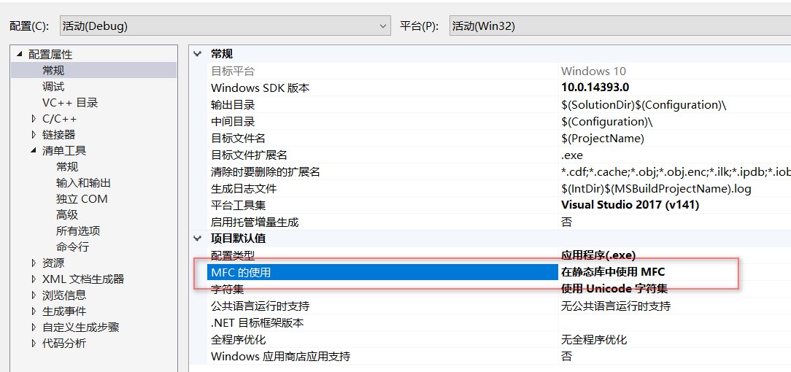

[toc]

# 手动创建第一个MFC程序

* 基于MFC的窗口必须也只能有一个CWinApp派生的对象

* 必须覆盖CWinApp的虚函数InitInstance在里面创建窗口并把窗口对象保存在它的成员变量m_pMainWnd中

```cpp
class CMyApp : public CWinApp
{
public:
	virtual BOOL InitInstance();
};

class CMainWindow :public CFrameWnd
{
public:
	CMainWindow();
};
```


* 创建窗口是通过派生CFrameWind对象，在它的构造函数里面调用成员函数create

```cpp
OOL CMyApp::InitInstance()
{
	m_pMainWnd = new CMainWindow;
	m_pMainWnd->ShowWindow(m_nCmdShow);
	m_pMainWnd->UpdateWindow();
	return TRUE;
}

CMainWindow::CMainWindow()
{
	Create(NULL, L"HelloMFC");
}
```


## 注意

* 创建Win32应用程序
* 包含MFC运行库



* 包含头文件`afxwin.h`

# MFC的初始化过程

## CWinApp的层次结构

* 全局对象或者全局变量会在main()函数之前执行

```cpp
CObject
    |__CCmdTarget
           |__CWndApp
                 |__CWinApp
                     
```

## CFrameWnd的层次结构

*  CFrameWnd提供Windows单文档重叠或是弹出式框架窗口，以及管理窗口的成员

```cpp
CObject
    |__CCmdTarget
           |__CWndApp
                 |__CFrameWnd
```

# MFC的运行时类型识别(RTTI)

* RTTI(Runtime Type Information)

运行时类型信息程序能够使用基类的指针或者引用来检查这些指针或引用所指的对象的实际派生类

* 三个关键的宏

**DECLARE_DYNAMIC**

**IMPLEMENT_DYNAMIC**

**RUNTIMEI_CLASS**

* 一个关键的结构体

```cpp
struct CRuntimeClass
{
// Attributes
	LPCSTR m_lpszClassName;
	int m_nObjectSize;
	UINT m_wSchema; // schema number of the loaded class
	CObject* (PASCAL* m_pfnCreateObject)(); // NULL => abstract class
#ifdef _AFXDLL
	CRuntimeClass* (PASCAL* m_pfnGetBaseClass)();
#else
	CRuntimeClass* m_pBaseClass;
#endif

// Operations
	CObject* CreateObject();
	BOOL IsDerivedFrom(const CRuntimeClass* pBaseClass) const;

	// dynamic name lookup and creation
	static CRuntimeClass* PASCAL FromName(LPCSTR lpszClassName);
	static CRuntimeClass* PASCAL FromName(LPCWSTR lpszClassName);
	static CObject* PASCAL CreateObject(LPCSTR lpszClassName);
	static CObject* PASCAL CreateObject(LPCWSTR lpszClassName);

// Implementation
	void Store(CArchive& ar) const;
	static CRuntimeClass* PASCAL Load(CArchive& ar, UINT* pwSchemaNum);

	// CRuntimeClass objects linked together in simple list
	CRuntimeClass* m_pNextClass;       // linked list of registered classes
	const AFX_CLASSINIT* m_pClassInit;
};
```


# 动态创建

